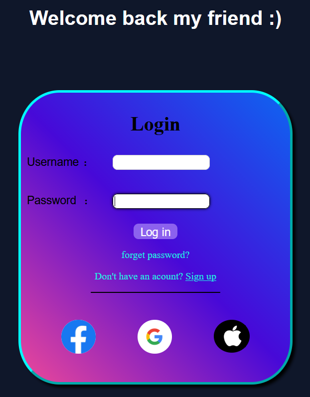
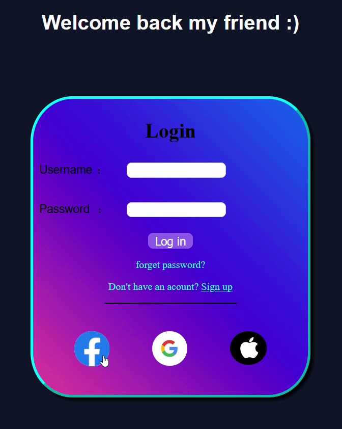
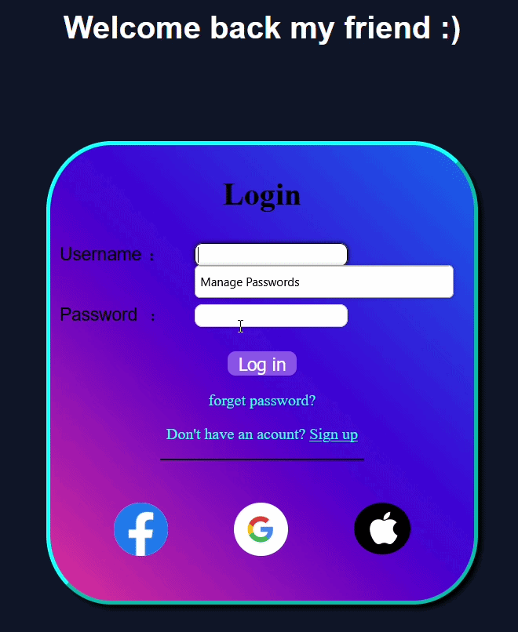

# Modern Login Page

## Project Description
A modern login page built using HTML and CSS, fully responsive and mobile-friendly.  
Designed with simplicity and usability in mind, demonstrating UI design skills.

## Technologies Used
- HTML
- CSS

## How to Run
1. Open the project on your computer.
2. Open `index.html` in any modern browser (Chrome, Firefox, Edge, etc.).
3. Explore the interface and see the design.

## Features
- Responsive design for all devices
- Simple and user-friendly interface
- Practical project to learn and apply HTML & CSS

## Screenshots

## Demo

### Social Icons Hover

### Login Button & Inputs Hover

## Notes
- All files are included in the project:
  - HTML: `index.html`
  - CSS: `style.css`
  - Images: in the `images` folder
- Feel free to edit the files for learning or experimentation.
